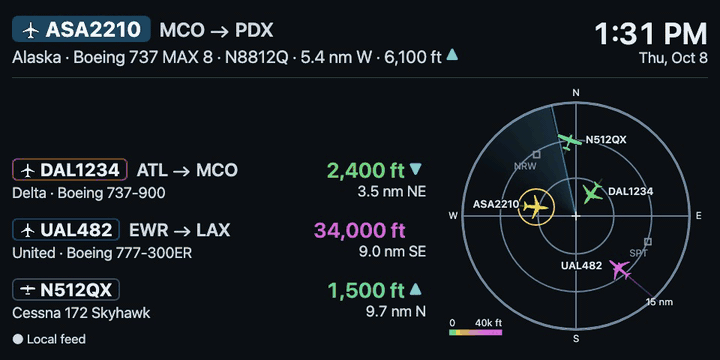
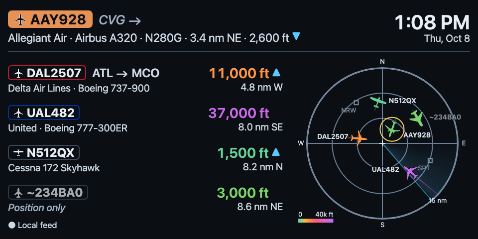
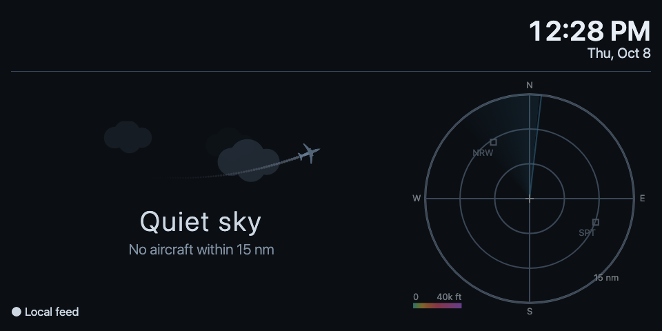
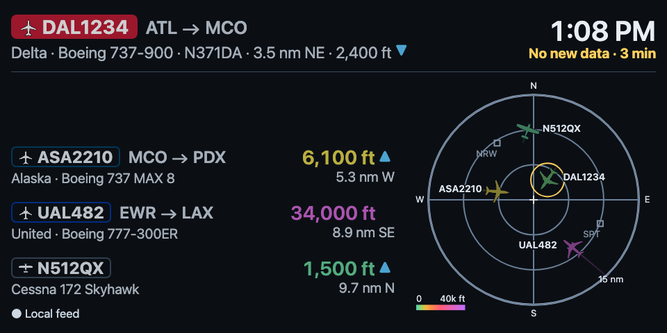

# ✈️ Nearby Flights

A screensaver for [Kiosk Satellite](https://kiosksatellite.com) that shows the aircraft flying over
the coordinates you enter, live.

*The sample screens in this README use made-up traffic. The scope is a sketch of where things are,
not a map.*

## Contents

- [What you get](#-what-you-get)
- [Supported devices](#-supported-devices)
- [Install](#-install)
- [What's on the screen](#-whats-on-the-screen)
- [Settings](#-settings)
- [How accurate is it?](#-how-accurate-is-it)
- [Privacy](#-privacy)
- [Troubleshooting](#-troubleshooting)
- [Data and credits](#-data-and-credits)
- [More](#-more)

## 🛫 What you get

- 🎯 **The closest aircraft up top:** callsign, route, airline, type, registration, distance,
  direction and altitude, with a little arrow if it's climbing or descending.
- 📋 **A list of the next ones**, closest first, with altitude colors from green (low) to purple (high).
- 📡 **A radar-style scope** with you at the center, nearby airports, and a short trail behind every aircraft.
- 🌙 **A quiet-sky screen** for when nothing is around, and a clock in the corner.
- 🔒 **Private by default:** your exact location stays on your device. See Privacy below.

Aircraft positions come from your own ADS-B receiver, the free [adsb.lol](https://adsb.lol) service,
or both. No account or key needed.

## 📱 Supported devices

| | |
|---|---|
| **Needs** | Kiosk Satellite with plugin support (plugin API version 1) on Android 7.0 or newer |
| **Tested on** | Echo Show 5 (960 × 480) |
| **Should work on** | Landscape screens from about 5:3 to 16:9, like 800 × 480, 1280 × 720 and 1920 × 1080. I checked those in a desktop browser, not on real hardware. |
| **Not yet** | 4:3 tablets and portrait screens. The layout was built for wide screens, so on those the list and the clock get clipped. |

Tried it on something else? Please report how it looks.

## 🚀 Install

1. In Kiosk Satellite, open **Settings > Plugin Manager** (or **Plugin Manager** in Remote Admin)
   and turn on **Enable Plugins**.
2. Choose **Add plugin**, paste this repository's GitHub URL, and choose **Preview**.
3. Read the manifest and this README, then choose **Trust and install**.
4. Enable the plugin from its row in the list, then open the row to reach its settings.
   Fill in your latitude and longitude at least.
5. Under **Screensaver > Screensaver mode**, pick **Nearby Flights**.

**Check that it works.** Open Kiosk Satellite's remote web UI and read the plugin's status line (on the device itself it
only says paused, and the screensaver has to be dismissed to see settings). `Primary source, N aircraft`
means positions are arriving. Start the screensaver from Kiosk Satellite and within about 30 seconds
you should see aircraft, or "Quiet sky" if nothing is in range. Turn on **Demo: quiet sky** if you
want to see the empty screen on purpose.

Two Kiosk Satellite settings can get in the way:

- **Its screensaver schedule wins.** A schedule that picks a screensaver by time of day overrides
  this plugin during those hours. Turn the schedule off or leave gaps in it.
- **Its clock and weather widgets draw on top.** The plugin has its own clock in the top right,
  so switch those widgets off for the screensaver. Pixel shift can stay on.

**Installing from a ZIP instead.** Download `nearby-flights-<version>.zip` from the
[Releases page](https://github.com/mpjanofsky/nearby-flights-screensaver/releases) (a `.sha256` file sits next to it), or build it yourself with
[docs/DEVELOPING.md](docs/DEVELOPING.md). Then use **Plugin Manager > Developer Tools > Install
from ZIP**. That route is meant for testing. Installing a newer ZIP over an old one keeps your
settings. To switch from a GitHub install to a local build, uninstall first, which deletes the
settings.

## 👀 What's on the screen

- **Top band:** the featured aircraft, usually the closest one. It stays for at least 20 seconds,
  and changes after that only if something else is clearly closer.
- **List:** up to four more aircraft, closest first.
- **Scope:** a radar-style view centered on the location you entered, with nearby airports marked.
  The closest aircraft gets a yellow circle.
- **Bottom left:** the data feed source (local feed, internet feed, or both).

### 🧭 About the routes

ADS-B doesn't carry a flight's route, so the plugin looks the callsign up in a community database
of scheduled flights. It's a good guess, not a promise, so the screen shows how sure it is:

| You see | Details |
|---|---|
| `ATL → MCO` | Origin and destination, both believed. |
| `CVG →` in grey italics | Only the origin is trusted. |
| Nothing after the callsign | No route. Private, military and small-airline flights usually don't get one. |
| `~234BA0` and "Position only" | A target with no proper aircraft address, so no callsign or details. Altitude and distance are still real. |

### 💤 Other screens

| Screen | Details |
|---|---|
|  | Nothing is inside your radius. With Soft radius on, it first looks farther out. |
|  | The plugin can't reach its data source, so what's on screen is getting old ("No new data · 3 min" in yellow). That means the receiver or adsb.lol is down or the network dropped. It keeps retrying and recovers by itself. |

## 🔧 Settings

Open the plugin's row in Plugin Manager. Changes apply straight away.

**📍 Location**

| Setting | Default | What it does |
|---|---|---|
| Home latitude / longitude | empty | Decimal degrees, like `27.1234` and `-82.1234`. Required. |
| Radius (nm) | 15 | How far out to look, 5 to 50. |
| Radius limit | Hard | **Hard** stays inside the radius. **Soft** reaches farther while the list has empty rows. |
| Soft reach (nm) | 60 | How far Soft may reach. Ignored on Hard. |

**🎨 Display**

| Setting | Default | What it does |
|---|---|---|
| Units | Aviation | **Aviation** (nautical miles, feet), **Metric** (km, m) or **Imperial** (miles, feet). |
| Clock format | Device default | Follow the device locale, or choose **12 hour** or **24 hour**. Uses the device time zone. |
| Rows | 4 | List rows under the top band, 1 to 4. |
| Hide general aviation | off | Hides light aircraft, helicopters and bare-registration callsigns. |
| Demo: quiet sky | off | Always shows the empty-sky screen. |

**📡 Sources**

| Setting | Default | What it does |
|---|---|---|
| Primary source | Local feed | **Local feed**, **adsb.lol**, or **Local + adsb.lol** (uses both and merges them, so you see farther than your antenna reaches). |
| Local feed URL | empty | Your receiver's `aircraft.json`, like `http://receiver.local:8080/data/aircraft.json`. |
| Fallback source | adsb.lol | What to use when the primary source is unavailable. Choose None to turn it off. |
| Refresh (s) | 10 | How often to fetch positions, 5 to 60 seconds. |

### No receiver?

Leave the local feed URL empty and the plugin uses adsb.lol on its own.

### Have a receiver?

Open your tar1090 page and add `/data/aircraft.json` to the same host and port. A page of JSON
with a long `"aircraft"` list is the right address. The plugin only reads it.

### Want to run your own receiver?

A cheap USB radio and a Raspberry Pi are enough. The
[ADS-B Ultrafeeder](https://github.com/sdr-enthusiasts/docker-adsb-ultrafeeder) project bundles
everything (readsb and tar1090 included) in one Docker container, with a quick-start guide.

Home receivers often don't hear callsigns or aircraft details for every plane, so the plugin fills
those in from lookups a few seconds later. A new row can change as details arrive.

## 🎯 How accurate is it?

- **Positions and altitude** come straight from ADS-B: the latest fix your receiver or adsb.lol
  has for each aircraft, usually a few seconds old. Anything older than a minute is dropped.
  Between updates the scope slides each aircraft along its last known track.
- **Airline and type** come from the callsign prefix (a table built into the plugin) and lookups by
  the aircraft's hex code.
- **Routes** are matched by callsign against a community database of scheduled flights. Airlines
  reuse a callsign on different legs, so occasionally you'll see the other leg of the same flight
  number. The plugin hides a route that doesn't fit where the aircraft actually is, and would
  rather show less than guess.

## 🔒 Privacy

- **Your coordinates stay on your device.** The only place they're saved is Kiosk Satellite's own
  plugin settings. The plugin writes nothing else to storage, and its lookup caches live in memory
  and disappear on restart.
- **Receiver only?** If you use your own receiver and set Fallback to None, your location never
  leaves your network.
- **adsb.lol** gets your location rounded to two decimals (about 1 km), with the radius plus
  1 nm, and sees your IP address. That applies whenever it's used: as primary, as the default
  fallback, or for the farther steps of Soft radius.
- **Aircraft lookups** (airline, type, route) send only an aircraft's hex code or callsign, never a
  location. Over weeks they add up to a list of the aircraft that fly near you.
- No analytics, and nothing is contacted that isn't in [docs/DATA-SOURCES.md](docs/DATA-SOURCES.md).

## 🧰 Troubleshooting

| What you see | What to check |
|---|---|
| The screensaver doesn't appear | Plugin switched on? Screensaver mode set to Nearby Flights? A Kiosk Satellite schedule can override it. |
| A message about settings | Latitude and longitude must be decimal numbers. The status line says what's wrong. |
| "Quiet sky" all the time | Radius too small, or Hide general aviation is on. Try a bigger radius or Soft. Check Demo: quiet sky is off. |
| "No new data" | The source isn't answering. Check the local feed URL in a browser. With the fallback on, it recovers by itself. |
| Fewer aircraft than a tracking website | A home antenna hears only part of the sky. Try Local + adsb.lol. |
| Airline or type is blank at first | They fill in a few seconds after an aircraft appears. |
| A route looks wrong | Routes are a best guess. See About the routes above. |
| Kiosk Satellite's clock covers the corner | Switch off its clock and weather widgets for the screensaver. |
| Very dim at night | Kiosk Satellite's adaptive brightness may be turning the panel down. |

The status line also shows what the plugin is up to, for example
`Primary source, 5 aircraft | rows with route 88%, airline 56%, callsign 99%; lookups 56 (err: hex 0, route 0), queue 0`.
Low route percentages are normal. Worry about `err:` numbers that keep climbing or a queue that
never empties, which means a lookup service isn't answering. Positions aren't affected. After three
failed fetches it reads `Stale:` and the reason.

## 🙏 Data and credits

What each service gives us, its terms and exactly what we send it are in
[docs/DATA-SOURCES.md](docs/DATA-SOURCES.md).

- Positions: your own receiver and/or [adsb.lol](https://adsb.lol). Contains information from
  adsb.lol, made available under the
  [Open Database License (ODbL)](https://opendatacommons.org/licenses/odbl/1-0/).
- Routes: [adsb.im](https://adsb.im)'s route API, which serves community-maintained
  [standing data](https://github.com/vradarserver/standing-data) (CC0).
- Aircraft registration and type: [adsbdb.com](https://www.adsbdb.com), which credits PlaneBase.
  Queried live, not stored or republished.
- Airports: [OurAirports](https://ourairports.com) (public domain), bundled with the plugin.
- Aircraft icons: ADS-B Radar for macOS, https://adsb-radar.com.

These are free community services, so the plugin keeps its requests small (one lookup per second
at most, results cached for hours) and backs off when a service is slow. If you fork it, please
keep to those limits.

## 📚 More

- Ideas or problems? Open an issue.
- For developers: [building and changing it](docs/DEVELOPING.md) and the
  [payload format](docs/payload.md).

🤖 Built with a lot of help from Claude, who worked with me on
most of the design, code, tests and docs.

Code is Apache-2.0 (see [LICENSE](LICENSE) and [NOTICE](NOTICE)).
